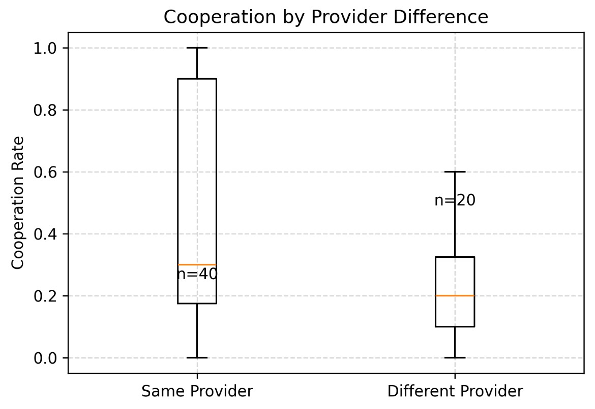
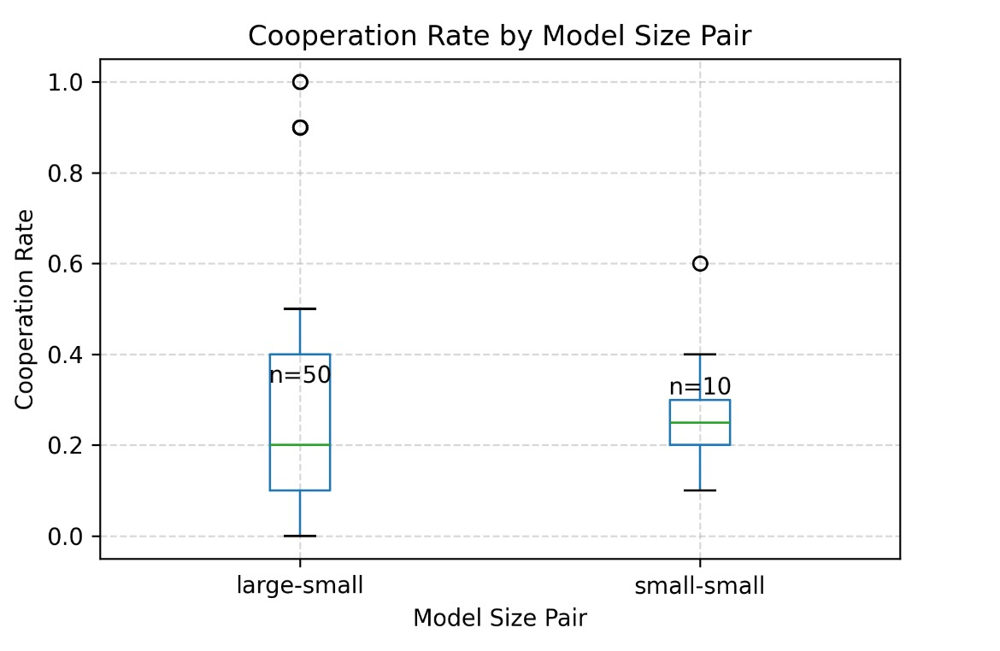
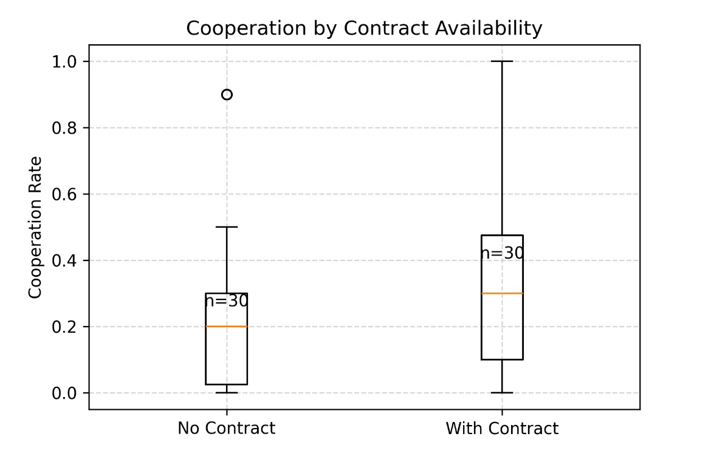

# Studying how effectively AI models can negotiate in a multi-turn prisoners dilemma

## Collaborative Agents: Looking into how Agents Cooperate in a Multi-Turn Prisoner’s Dilemma

I looked at six pairings of agents—across OpenAI, Anthropic & Gemini models—and measured how model provider and size affects collaboration, and I explored giving models the option to make, and break contracts between each other, to see how this affects cooperative behavior. Here’s what I found.

---

## 1. Experimental Setup

### Agent Strategies
* Each pairing was tested in two conditions: **with** and **without** the ability to form and break contracts.* Contract decisions were explicitly logged as structured "yes" or "no" decisions made by the agents.

### Models Used

| Model | Provider | Size |
| -------------------- | --------- | ----- |
| GPT-4o | OpenAI | Large |
| GPT-4o-mini | OpenAI | Small |
| Claude 3.5 Sonnet V2 | Anthropic | Small |
| Gemini 1.5 Pro | Gemini | Large |
| Gemini 1.5 Flash | Gemini | Small |

### Pairings Tested

* GPT-4 vs Claude 3.5-v2
* GPT-4 vs GPT-4-mini
* Claude 3.5-v2 vs GPT-4-mini
* Gemini 1.5-pro vs Gemini 1.5-flash
* Gemini 1.5-pro vs GPT-4-mini
* Gemini 1.5-pro vs Claude 3.5-v2

Each pairing was evaluated in repeated interactions to ensure statistical robustness.

---

## 2. Cooperation Results

### Provider Differences

* Cooperation was significantly higher between models from the **same provider** compared to models from **different providers**.
* **Same-provider average cooperation:** approximately **45%*** **Different-provider average cooperation:** approximately **21%**

### Model Size Effects

* Pairings between **one large and one small model** showed considerably higher cooperation rates compared to pairings of **two large models**.
* **Large-small pair average cooperation:** about **65%*** **Large-large pair average cooperation:** about **22%**

### Effect of Contracts

* Allowing contracts led to a significant improvement in cooperation across all pairings.
* **With contracts:** average cooperation rose to around **36%*** **Without contracts:** average cooperation was lower, around **22%**

---

## 3. Contract-Breaking Behavior

### Power Dynamics (Model Size)

* Smaller models consistently broke contracts more frequently when interacting with larger models.
* **Small model breaking contracts with large:** about **87%** of the time
* **Large model breaking contracts with small:** about **22%** of the time

**Insert plot: "Contract Break Rate by Size Direction" bar chart here**

### Provider Trust Dynamics
* Surprisingly, contract breaking was more frequent between models from the **same provider** than those from **different providers**.
* **Same-provider break rate:** approximately **60%**
* **Different-provider break rate:** approximately **45%**
**Insert plot: "Contract Break Rate by Provider Relationship" bar chart here**

---

## 4. Discussion
* **Same-provider cooperation** is significantly higher, possibly due to underlying similarities in model training and behavioral tendencies
* **Mixed-size pairings** appear to balance incentives, possibly due to differing strategic perspectives or a perceived hierarchy.
* **Contracts serve as effective commitment mechanisms**, enhancing overall cooperation.
* The tendency of smaller models to frequently break contracts with larger models suggests an exploitation of asymmetric expectations.
* Increased contract breaking between same-provider models may be due to heightened competitive or strategic dynamics within a shared ecosystem.

### Implications and Recommendations
* Deploying **mixed-size agent teams** with explicit contracts might yield optimal cooperation.
* Careful consideration of provider ecosystems is crucial; diversity in provider selection could reduce competitive dynamics.
* Further work should explore varied contract penalties and more complex multi-agent settings to deepen understanding.
---
## 5. Conclusion

* Cooperation significantly improves with provider alignment, mixed-size pairings, and contract availability.
* Contract making and breaking is nuanced, heavily influenced by model size and provider alignment.
This study reveals essential insights into designing cooperative multi-agent systems with AI models.